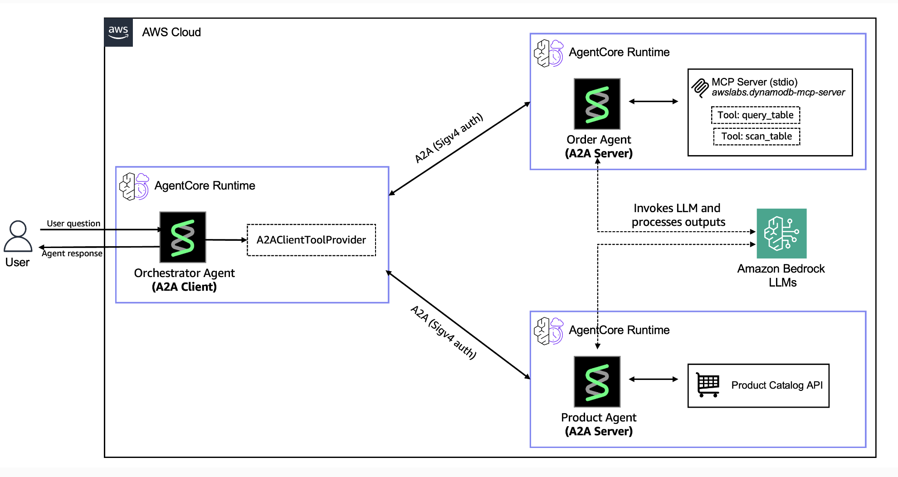

# Multi-Agent A2A: Deploy and Orchestrate on Amazon Bedrock AgentCore

This tutorial demonstrates how to use the Strands Agents SDK to build and deploy a multi-agent system on Amazon Bedrock AgentCore. You will create three specialized agents, each running in its own managed runtime, that discover and communicate with one another through the Agent-to-Agent (A2A) protocol. To illustrate the pattern, the tutorial implements an e-commerce shopping assistant that includes cooperating agents: a product search agent, an order lookup agent, and an orchestration agent.



## Tutorial Details

| Information            | Details                                                       |
|------------------------|---------------------------------------------------------------|
| **Strands Features**   | Multi-agent orchestration, A2A protocol, MCP tool integration |
| **Agent Pattern**      | Orchestrator + specialist agents                              |
| **Tools**              | Custom HTTP tools (DummyJSON API), MCP tools (Amazon DynamoDB), A2A client tools |
| **Model**              | Claude Sonnet 4 on Amazon Bedrock                             |

## Key Concepts

- **A2A Protocol**: Open HTTP-based protocol that lets the orchestration agent discover specialist agents and call them using standardized JSON-RPC messages
- **Agent Card Discovery**: Each A2A agent publishes an agent card describing its capabilities, which the orchestrator reads to automatically create tools for calling that agent
- **SigV4 Authentication**: Every inter-agent request is signed with AWS Signature Version 4 so that only authorized agents can communicate with each other
- **MCP Integration**: The Order Agent connects to an MCP server that exposes Amazon DynamoDB operations as tools, so it can query order data through a consistent tool interface
- **SSM Parameter Store**: Agent runtime URLs are stored in AWS Systems Manager Parameter Store, allowing the orchestrator to look up agent endpoints dynamically at runtime

## Prerequisites

- Python 3.10 or higher
- AWS CLI configured with appropriate permissions
- Docker or Podman installed (optional if using AWS CodeBuild)
- Claude Sonnet 4 model access in Amazon Bedrock (`us.anthropic.claude-sonnet-4-20250514-v1:0`)
- IAM permissions to:
  - Create IAM roles and policies
  - Create Amazon ECR repositories
  - Deploy Amazon Bedrock AgentCore runtimes
  - Write to AWS Systems Manager Parameter Store
  - Create and manage Amazon DynamoDB tables

## Tutorial Structure

| Notebook | Agent | Description |
|----------|-------|-------------|
| [01-a2a-server-product-agent.ipynb](./01-a2a-server-product-agent.ipynb) | Product Agent | A2A server with [DummyJSON](https://dummyjson.com) API tools for product catalog search |
| [02-a2a-server-order-agent.ipynb](./02-a2a-server-order-agent.ipynb) | Order Agent | A2A server with MCP integration for Amazon DynamoDB order lookup |
| [03-a2a-client-orchestrator-agent.ipynb](./03-a2a-client-orchestrator-agent.ipynb) | Orchestrator | User-facing HTTP endpoint that routes queries to specialist agents via A2A |

## Getting Started

1. **Install dependencies:**
   ```bash
   pip install -r requirements.txt
   ```

2. **Run the notebooks in order:**
   - **Notebook 1**: Deploy Product Agent
   - **Notebook 2**: Deploy Order Agent (creates Amazon DynamoDB table with sample data)
   - **Notebook 3**: Deploy Orchestrator and test the complete system

3. **Test the system** through the Orchestrator endpoint (output by Notebook 3) with queries like:
   - "Show me laptops under $1000"
   - "What are my recent orders?"
   - "Search for wireless headphones"

## Project Structure

```
01-a2a-orchestration/
├── 01-a2a-server-product-agent.ipynb
├── 02-a2a-server-order-agent.ipynb
├── 03-a2a-client-orchestrator-agent.ipynb
├── requirements.txt
├── product_agent/
│   ├── a2a_server.py               # Generated by notebook
│   └── requirements.txt
├── order_agent/
│   ├── a2a_server.py               # Generated by notebook
│   └── requirements.txt            # Generated by notebook
├── orchestrator/
│   ├── agent.py                    # Generated by notebook
│   ├── app.py                      # Generated by notebook
│   └── requirements.txt            # Generated by notebook
├── utils/
│   ├── config.py                   # SSM paths and agent names
│   ├── iam.py                      # IAM role creation
│   ├── ssm_helpers.py              # Parameter Store helpers
│   ├── dynamodb_setup.py           # DynamoDB table setup
│   ├── sigv4_auth.py               # SigV4 authentication
│   ├── streaming.py                # Response streaming utilities
│   └── callbacks.py                # Tool logging callback handlers
└── sample_data/
    └── orders.json
```

## Cleanup

Each notebook includes cleanup cells at the end that destroy its own resources. Wait until you have completed all three notebooks before running any cleanup, since earlier agents must remain active for downstream notebooks to work. Then run the cleanup cells in each notebook to remove all AWS resources (Amazon Bedrock AgentCore runtimes, Amazon ECR repositories, IAM roles, SSM parameters, and Amazon DynamoDB tables).

## Additional Resources

- [Strands Agents A2A Documentation](https://strandsagents.com/latest/documentation/docs/user-guide/concepts/multi-agent/agent-to-agent/)
- [Amazon Bedrock AgentCore Documentation](https://docs.aws.amazon.com/bedrock-agentcore/latest/devguide/)
- [Strands Agents MCP Integration](https://strandsagents.com/latest/documentation/docs/user-guide/concepts/tools/mcp-tools/)
- [Deploy to Amazon Bedrock AgentCore](https://strandsagents.com/latest/documentation/docs/user-guide/deploy/deploy_to_bedrock_agentcore/)
